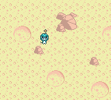

# Star Anise Chronicles: Cheezball Rising

Hello!  This is a brand new adventure game for the Game Boy Color.  It's about my cat Anise, having adventures.



I'm also [writing about the entire development process in gratuitous detail](https://eev.ee/everything/tags/cheezball-rising/) on my blog, if you'd like to follow along!


## Playing

The canonical source for builds is [Patreon](https://www.patreon.com/eevee/posts?tag=cheezball%20rising), where you can get access a _whole week early_ for only $4 a month!  I may also upload builds [here](https://github.com/eevee/anise-cheezball-rising/releases), um, when I remember.

A Game Boy Color emulator is helpful!  My favorite is [mGBA](https://mgba.io/) (I'm using [recent builds](https://mgba.io/downloads.html#development-downloads) of 0.7) — try loading the `gba-colors` shader for a more pastel aesthetic.  Allegedly, [BGB](http://bgb.bircd.org/) is also good for Windows and [SameBoy](https://sameboy.github.io/) is good for Mac.

Of course, you could always play the game on actual hardware, too.


## Building

You will need:

- [rgbds](https://github.com/rednex/rgbds), the recenter the better
- Python 3 with Pillow installed
- `make`

Do the following:

```
make
```

Wow!  You did it.  🎆  Enjoy!

(Actually, you probably didn't — currently I have some intermediate build assets that require manual intervention to actually get working.  Sorry!  I'll fix it soon.  Or maybe I already did, but forgot I put this paragraph in the README.)


## Development

I'll gladly accept advice on idioms and errors and whatnot, but would prefer no non-trivial pull requests — I'd like to be able to account, personally, for every last byte in the finished game.

That said, [feel free](LICENSE.md) to use this as a base for something of your own!  The following may be helpful:

- [awesome-gbdev](https://github.com/avivace/awesome-gbdev), a massive list of Game Boy dev resources
- the _official_ Nintendo [Game Boy Programming Manual](https://archive.org/download/GameBoyProgManVer1.1/GameBoyProgManVer1.1.pdf)
- the very helpful [Game Boy development wiki](http://gbdev.gg8.se/wiki/articles/Main_Page), which often clarifies or corrects or expands upon the manual
- a compact table of [gbz80 opcodes](http://www.pastraiser.com/cpu/gameboy/gameboy_opcodes.html)
- rgbds's own [documentation](https://rednex.github.io/rgbds/)
